**1a) Traducir el segmento de texto que le corresponda del documento denominado “Diseño y Pruebas basadas en Realidad Virtual/ Realidad Aumentada de Sistemas Mecatrónicos Avanzados” (archivo MaGausemeierFan_VR&ARinI_cap1.pdf)**

**Legajo 13567**

**6 o 7 → cap. 6 a 6.3**

**Prueba de Sistemas Mecatrónicos Avanzados Basadas en AR y VR**

Para el desarrollo de un sistema mecatrónico avanzado como el RailCab, primero aplicamos la técnica de especificación, que se introdujo en la sección anterior, para definir una solución de principio del RailCab. Basándonos en esta solución de principio, luego desarrollamos numerosos prototipos virtuales y bancos de pruebas para prototipos reales, con el fin de analizar y evaluar el comportamiento de los componentes y módulos seleccionados del RailCab. Sin embargo, el análisis y la evaluación del RailCab y sus componentes pueden volverse complejos y consumir mucho tiempo, debido a dos razones principales:

- El RailCab puede mostrar un comportamiento bastante complejo, por ejemplo, cuando un RailCab se une o se separa de un convoy. Estos procesos ocurren rápidamente e involucran numerosas variables y datos, lo que dificulta que el ingeniero comprenda el curso de acción y mantenga una visión general de todo el procedimiento.
- Algunos prototipos de los componentes del RailCab, por ejemplo, el banco de pruebas del tren de rodaje del RailCab, operan rápidamente y sus partes se mueven mayormente solo unos pocos milímetros. Para el ingeniero, tales movimientos diminutos son difíciles de percibir.

Por estas razones, aplicamos dos enfoques, uno basado en AR y otro en VR, para facilitar el análisis y la evaluación de prototipos seleccionados y sus bancos de pruebas:

- Para el enfoque basado en AR, combinamos variables y datos de pruebas del prototipo y su banco de pruebas, y utilizamos la tecnología AR para aumentar la vista del ingeniero sobre el sistema, superponiendo información relevante en su campo de visión.
- Para el enfoque basado en VR, aplicamos la tecnología VR para visualizar componentes faltantes, como por ejemplo la pista de pruebas, con el fin de simular cómo se desempeña el prototipo del tren de rodaje en pistas de prueba alternativas, distintas a nuestra pista de prueba real en el campus de Paderborn.

En las siguientes subsecciones, describimos estos dos ejemplos, que demuestran nuestros enfoques basados en AR y VR para facilitar los procedimientos de análisis y evaluación de dos prototipos del RailCab.

**6.1 Análisis Visual Basado en AR del Comportamiento del Convoy**

En el primer ejemplo, aplicamos la tecnología AR para facilitar el análisis del proceso de construcción de convoyes de varios RailCabs en la pista de pruebas en el campus de la universidad en Paderborn. Como solo tenemos un prototipo real de RailCab disponible para conducir en la pista de pruebas, necesitamos simular RailCabs virtuales adicionales para poder simular procesos de formación de convoyes. Basándonos en la tecnología AR, proyectamos los RailCabs virtuales en un video del RailCab real que está circulando por la pista de pruebas. La aplicación AR combina y visualiza toda la información relevante directamente en la pantalla, de modo que el ingeniero puede observar fácilmente el proceso de formación de convoyes en un solo monitor. Además, la aplicación AR permite comprobar qué tan bien coopera una versión alternativa del software de control con versiones anteriores durante un proceso de formación de convoyes.

Para evaluar el concepto del manejo de convoy y el controlador en un entorno realista, se ha desarrollado un sistema de hardware-in-the-loop (HIL) [14]. En este sistema HIL, un RailCab real y cuatro RailCabs simulados se han combinado en un convoy. El principio se muestra en la Fig. 23. El RailCab real circula por la pista de pruebas en el campus de la universidad y sirve como líder del convoy. La unidad de control del convoy dentro de este vehículo gestiona todo el convoy. El concepto de convoyes autónomos requiere que los RailCabs circulen consecutivamente a una distancia de menos de un metro sin ningún acoplamiento mecánico [15-17]. Para lograr esto, los RailCabs deben comunicarse entre sí. Por lo tanto, el RailCab líder transmite su posición y velocidad puntera a los cuatro vehículos simulados, que usan esta información para guiarse. Todos los sensores, actuadores y las partes mecánicas de los RailCabs virtuales están simulados. Para evitar colisiones entre los RailCabs dentro del convoy, cada vehículo es controlado en cuanto a distancia por un controlador de velocidad subordinado. La distancia se regula en relación con la posición del RailCab que circula delante.

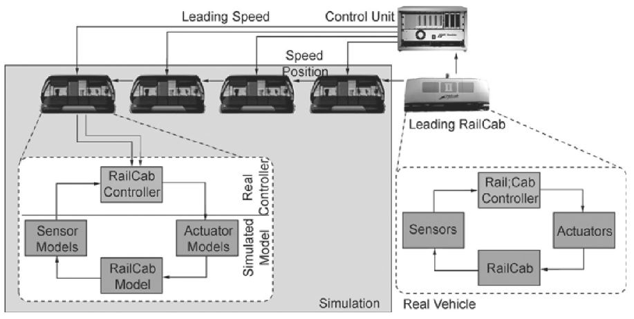

La limitación de la simulación HIL es que los RailCabs simulados no son visibles en la pista de pruebas. Su movimiento solo puede ilustrarse mediante un gráfico temporal. Sin embargo, al usar el banco de pruebas basado en HIL, es difícil probar diferentes estrategias de control y configuraciones de parámetros de manera interactiva durante los experimentos en línea. Por lo general, el ingeniero debe realizar un experimento en la pista de pruebas, recopilar y guardar los datos para su posterior análisis en el laboratorio. Cambiar las estrategias o configuraciones de parámetros de forma interactiva durante un experimento en curso es limitado y complicado. Una visualización basada en AR de los RailCabs simulados y los datos correspondientes, que explique su comportamiento, permite una prueba interactiva de la simulación HIL.

Por esta razón, hemos desarrollado una aplicación basada en AR para visualizar los RailCabs simulados y parámetros adicionales en la pista de pruebas real. Facilitamos un análisis visual del comportamiento del convoy en el banco de pruebas basado en HIL. Esto permite a los ingenieros comprender el comportamiento de la prueba HIL durante un experimento en línea.

Una pregunta crucial para el análisis es: ¿Es el convoy capaz de moverse sin colisiones utilizando diferentes estrategias de control y parámetros? Para esto, visualizamos la forma de los RailCabs simulados y su movimiento en la pista de pruebas real, así como datos de control abstractos como la posición y velocidad de cada RailCab, la distancia entre dos RailCabs, la distancia de frenado y la velocidad puntera. A continuación, presentamos cuatro temas de análisis, con el fin de ilustrar cómo la visualización basada en AR facilita las pruebas del banco de pruebas basado en HIL y la evaluación del comportamiento del convoy.

**Convoyes:** Una pregunta importante para una operación energéticamente eficiente de los RailCabs es, cómo se puede establecer y mantener un convoy de manera efectiva. La Figura 24 muestra un convoy que consiste en un RailCab real seguido por tres RailCabs virtuales. Ver los RailCabs simulados superpuestos en la pista de pruebas ayuda a los ingenieros a reconocer si los RailCabs están conduciendo en un convoy o si un RailCab pierde contacto con el convoy. En la Figura 24, el último RailCab ha perdido contacto con el convoy, y la distancia entre el último RailCab y el convoy precedente es demasiado grande para aprovechar el rebufo.

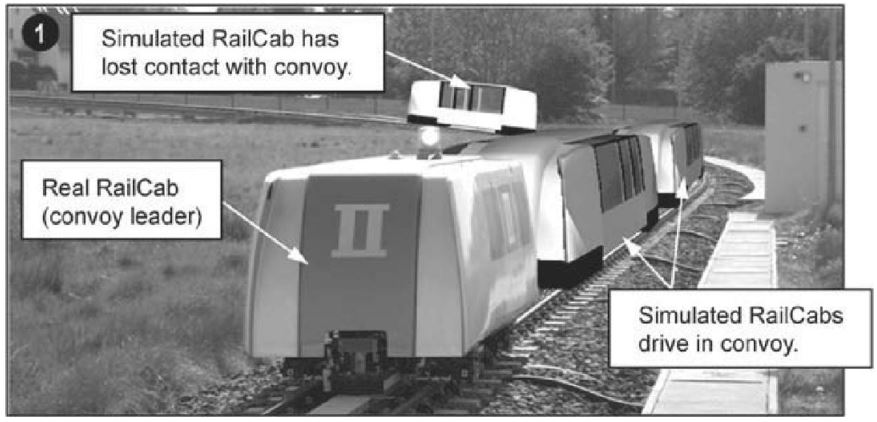

Las **colisiones** pueden ocurrir cuando los RailCabs intentan minimizar su distancia con respecto a los RailCabs precedentes en un convoy, con el fin de reducir la resistencia del aire y ahorrar energía. La Figura 25 ilustra el análisis basado en AR de una colisión entre dos RailCabs. Si dos RailCabs chocan, sus formas se resaltan en rojo. Si la distancia entre dos RailCabs cae por debajo de un límite especificado, una advertencia de colisión indica una posible colisión inminente. En la visualización, esto se indica mediante un RailCab parpadeante.

La **calidad del control** es un indicador importante que ayuda a evitar condiciones críticas mientras se conduce en un convoy. En la aplicación basada en AR, visualizamos dichas cantidades abstractas mediante plausibles códigos de color facilmente entendibles. La Figura 26 muestra una visualización de la calidad del control de cada RailCab utilizando dicho código de color.

Aquí, los RailCabs se destacan en una gama de colores que va desde el verde, pasando por el amarillo, hasta el rojo. Los tonos de color indican qué tan bien el controlador en cada RailCab es capaz de seguir cualquier valor de referencia que el controlador del convoy en el RailCab líder, que funciona como el líder del convoy, comunica a todos los miembros del convoy.

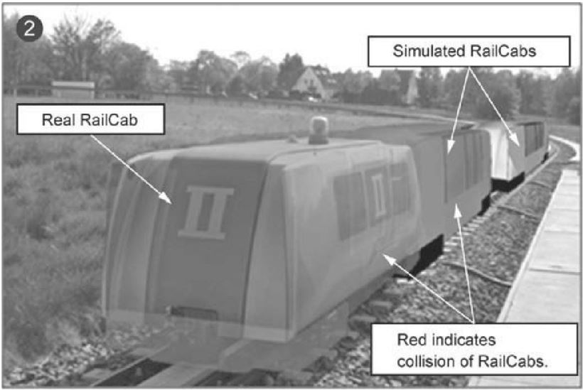

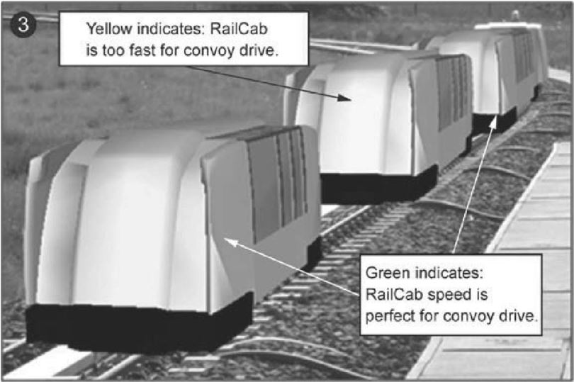

**Distancia de frenado:** En caso de una falla en el sistema o en algún componente, uno de los parámetros cruciales para el controlador del convoy es la distancia de frenado de cada RailCab. La distancia de frenado influye directamente en el comportamiento del convoy y ayuda a prevenir colisiones traseras para una operación segura del convoy. Para una conducción segura del convoy, la distancia de frenado de un RailCab que sigue a otro en un convoy debe, en todo momento, ser menor que la distancia de frenado del RailCab que lo precede. Para visualizar la distancia de frenado, se superpone una barra roja en la pista (ver Figura 27). La sección resaltada de la pista indica la distancia de frenado estimada del RailCab. La barra roja vertical al final de la sección resaltada de la pista indica la posición final esperada en la que el RailCab se detendrá por completo.

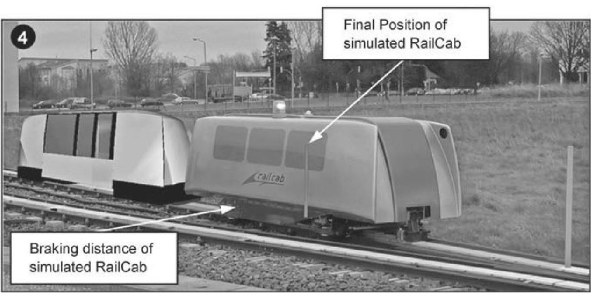

**6.2 Realización del Sistema de Realidad Aumentada**

La Figura 28 muestra la configuración del banco de pruebas HIL a la izquierda y la configuración del sistema de AR a la derecha. Un servidor de comunicaciones está integrado entre ambos componentes. La mitad inferior de la Figura 28 muestra la mesa de control del operador para observar la pista de pruebas.

El banco de pruebas HIL está compuesto por un RailCab real y un sistema de prototipado en tiempo real, producido por dSpace. En el sistema en tiempo real, se está ejecutando una simulación de cuatro RailCabs reales bajo condiciones de tiempo real estricto. El RailCab real en la pista de pruebas es el líder del convoy simulado. Este RailCab se comunica con el sistema de simulación a través de un sistema propietario de bus interno.

El sistema de simulación envía datos de posición y velocidad de todos los RailCabs al servidor de comunicaciones. El servidor se utiliza como una interfaz entre el banco de pruebas HIL, que opera bajo condiciones de tiempo real estricto, y el sistema de AR, que funciona bajo condiciones de tiempo real flexible. Cada 10 ms, el banco de pruebas HIL envía datos de los RailCabs al servidor de comunicaciones. Dado que el sistema de AR solo renderiza una nueva imagen cada 40 ms, recibe cada cuarto paquete de datos del servidor de comunicaciones.

El sistema de AR está compuesto por una PC con un procesador Pentium 4 de 2.8 GHz Dual Core, una tarjeta gráfica NVIDIA 8800 GTX y 2 GB de RAM. El dispositivo de salida para el video es un monitor HDTV con una relación de aspecto amplia de 16:9. Para grabar el video de la pista de pruebas, se utiliza una cámara de video Sony HVR-VIE HDV. Tanto el monitor como la cámara tienen una resolución de 1980 × 1080 píxeles. Necesitamos la alta resolución para poder monitorear no solo los RailCabs que pasan cerca de la cámara, sino también aquellos RailCabs que circulan en el lado más lejano de la pista de pruebas.

La aplicación de software de AR fue implementada en C++ y el kit de herramientas gráficas 3D OpenSceneGraph, que ofrece varias funciones para renderizar objetos 3D animados. La imagen de video se renderiza como una imagen 2D en el fondo con el fragment shader de la tarjeta gráfica. Para mostrar los RailCabs simulados en la aplicación de AR, se integraron modelos CAD del RailCab real en la aplicación.

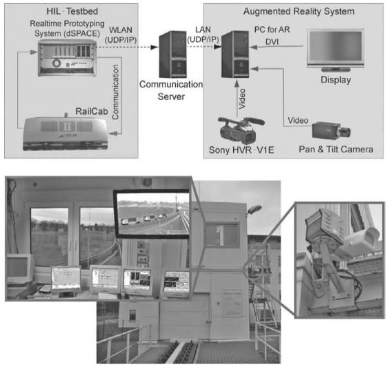

**6.3 Análisis Visual Basado en VR del Sistema de Rodaje del RailCab**

El segundo ejemplo describe el uso de la tecnología de realidad virtual (VR) para facilitar las pruebas dirigidas de los componentes del sistema de rodaje del RailCab, así como para el desarrollo del controlador. En la Universidad de Paderborn se ha desarrollado un banco de pruebas para el sistema de rodaje del RailCab a una escala de 1:2.5. El sistema de rodaje del RailCab se dirige activamente sobre desvíos pasivos, lo que permite al RailCab elegir su dirección en un desvío.

Como las ruedas no están forzadas a seguir las vías, como en los trenes convencionales, la guía a lo largo de una vía y la dirección sobre un desvío requieren fuerzas de fricción. Estas son particularmente importantes en vías mojadas o heladas. Esto nos llevó a desarrollar un sistema de rodaje con inclinación variable, que controla activamente la inclinación de las ruedas. El objetivo es desacoplar las fuerzas de guía y dirección de las fuerzas de fricción entre la rueda y la vía. Además, el sistema de rodaje dirige activamente cada rueda de manera individual, con el fin de reducir significativamente el par y las fuerzas de fricción al dirigir el RailCab sobre un desvío.

A la izquierda de la Figura 29 se muestra un perfil de una vía y una rueda con ángulos de inclinación variables y sin ángulo de inclinación cambiado. La vía tiene un perfil de corte esférico, de modo que las ruedas pueden apoyarse en ella mientras se inclinan.

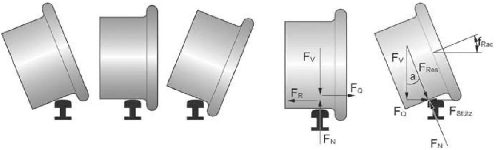

A la derecha de la Figura 29 se muestra cómo se distribuyen las fuerzas en una rueda en posición normal y en una rueda inclinada. Si la rueda está en posición vertical, el RailCab es sostenido en la vía por la fuerza de fricción \( F_R \). La fuerza de fricción compensa la fuerza cortante \( F_Q \), que puede ser generada, por ejemplo, por la fuerza centrífuga. Cuando una rueda se inclina, se apoya mecánicamente en la vía. La fuerza cortante es compensada por la fuerza lateral del perfil \( F_v \) en el punto de contacto de la rueda, pero ya no por la fricción.

**2. Revisar los ejemplos de aplicación planteados en el libro “Developing Virtual reality Applications” (de Alan Craig y otros) y realice las siguientes actividades:**

**2a. Detalle una lista de los proyectos representados, describiendolos brevemente.**

**Casos de estudio del libro: "Desarrollo de aplicaciones de Realidad Virtual"**

**Aplicaciones en el ámbito de negocios y manufactura (Capítulo 3)**

**"Wellington Zoo Augmented Reality for Advertising" (caso de estudio 3.1)**

La campaña "Wellington Zoo Augmented Reality for Advertising" utilizó tecnología de realidad aumentada para dar vida a los animales del zoológico en anuncios impresos y digitales. Los usuarios podían escanear un código QR con sus teléfonos móviles, lo que activaba la experiencia AR. A través de la cámara del dispositivo, los animales aparecían en 3D sobre la superficie escaneada, como si estuvieran en el entorno del usuario. 

La campaña fue diseñada para ser interactiva y educativa, permitiendo a los usuarios acercarse virtualmente a animales en peligro de extinción, con el objetivo de sensibilizar sobre la conservación. El software utilizado permitía el seguimiento preciso de las imágenes y la superposición en tiempo real de modelos 3D de alta calidad de los animales. La experiencia era compatible con la mayoría de los smartphones y no requería la instalación de aplicaciones adicionales, lo que facilitaba el acceso del público.

Este uso de AR no solo captó la atención del público de manera novedosa, sino que también logró un alto nivel de interacción, lo que resultó en una mayor conciencia sobre los esfuerzos de conservación del zoológico.

**"Caterpillar Virtual Prototyping System" (caso de estudio 3.2)**

El sistema de prototipado virtual de Caterpillar (Virtual Prototyping System) es una solución avanzada que utiliza realidad virtual (VR) para simular y analizar el comportamiento de sus maquinarias en un entorno digital. Implementado con software de simulación y modelado 3D, este sistema permite a los ingenieros interactuar con modelos virtuales de equipos a través de interfaces inmersivas que además permiten la interacción en el mismo mundo virtual con operadores en distintas ubicaciones geográficas.

Las simulaciones incluyen análisis de tensión, vibración, y rendimiento bajo diferentes condiciones operativas. Estas simulaciones permiten a los ingenieros identificar y resolver problemas potenciales antes de construir un prototipo físico. Además, la realidad virtual permite pruebas de visibilidad y ergonomía, mejorando la seguridad y la comodidad del operador.

Las ventajas del sistema incluyen una reducción significativa en los costos y tiempo de desarrollo, así como una mejora en la precisión del diseño, lo que resulta en productos más eficientes y fiables.

**VisualEyes™ de General Motors (caso de estudio 3.3)**

VisualEyes™ de General Motors es una tecnología avanzada de realidad virtual que transforma el diseño de vehículos mediante la creación de un entorno virtual inmersivo en 3D. Utilizando el concepto de Cave Automatic Virtual Environment (CAVE), permite a los diseñadores e ingenieros visualizar y modificar prototipos en un espacio envolvente rodeado de pantallas estereoscópicas. Los usuarios interactúan con el modelo mediante controladores 3D y dispositivos de seguimiento de movimiento, lo que facilita una colaboración efectiva al permitir que varios miembros del equipo trabajen simultáneamente en tiempo real. Esta solución mejora la precisión en el diseño, reduce costos al evitar prototipos físicos y optimiza el proceso de desarrollo al permitir ajustes antes de la producción.

**The Boiler Maker de Nalco Fuel Tech (caso de estudio 3.4)**

En el proyecto **The Boiler Maker**, la realidad virtual (VR) se implementó como una herramienta esencial para visualizar y simular los complejos procesos de combustión en calderas industriales. Utilizando un entorno 3D interactivo, los ingenieros pudieron "entrar" en las calderas y observar el comportamiento de los flujos de gases y la distribución de calor en tiempo real, facilitando la identificación de mejoras y la evaluación de diferentes escenarios operativos. Además, la VR permitió la colaboración simultánea de varios usuarios dentro del entorno virtual y se utilizó para entrenar a operadores y técnicos en el funcionamiento optimizado de las calderas.

**Cutty Sark Virtual Voyage (caso de estudio 3.5)**

Es una experiencia de realidad virtual que permite a los usuarios explorar de manera inmersiva el famoso barco clipper británico **Cutty Sark**, conocido por su velocidad y su papel en el comercio del té en el siglo XIX. Este proyecto recrea digitalmente el barco, permitiendo a los usuarios moverse libremente por sus cubiertas y áreas interiores, mientras interactúan con diversos elementos como izar velas o manejar el timón. La experiencia combina educación y entretenimiento al ofrecer una narrativa histórica detallada que guía a los usuarios a través de la vida y los viajes del Cutty Sark, brindando una comprensión profunda de la historia marítima y la ingeniería náutica de la época.

**Aplicaciones en el ámbito Científico (Capítulo 4)**

**Virtual WindTunnel (caso de estudio 4.1)**

El **Virtual Windtunnel** del NASA Ames Research Center es una avanzada herramienta de simulación que utiliza dinámica de fluidos computacional (CFD) para modelar el comportamiento del flujo de aire alrededor de objetos en un entorno virtual. La implementación en realidad virtual permite a los ingenieros y científicos visualizar en tiempo real cómo el aire interactúa con superficies, identificando detalles como turbulencias y vórtices con gran precisión. Los usuarios pueden sumergirse en el flujo de datos, observando de cerca las fuerzas aerodinámicas que actúan sobre los modelos simulados. Además, el sistema está diseñado para ser colaborativo, permitiendo que múltiples expertos trabajen simultáneamente en la simulación desde diferentes ubicaciones. La visualización en VR ofrece una experiencia inmersiva, donde los usuarios pueden explorar los efectos aerodinámicos desde todos los ángulos, facilitando una comprensión profunda de los comportamientos del flujo de aire en diversas condiciones operativas.

**BayWalk (caso de estudio 4.2)**

**BayWalk**, desarrollado por el Army Corps of Engineers Waterways Experimentation Station (CEWES) junto con el National Center for Supercomputing Applications (NCSA), es una herramienta avanzada de simulación hidrodinámica y visualización en 3D que utiliza realidad virtual para permitir una exploración inmersiva de entornos acuáticos como bahías y estuarios. La implementación en VR permite a los usuarios "caminar" a través de simulaciones en tiempo real, observando el comportamiento de las corrientes, mareas, y otros fenómenos desde múltiples perspectivas. Esta capacidad facilita una comprensión más profunda de los datos complejos y mejora la colaboración entre expertos en diferentes ubicaciones, quienes pueden interactuar con los mismos modelos en un entorno virtual compartido.

**VEVI Toolkit(caso de estudio 4.3)**

**VEVI (Virtual Environment Vehicle Interface)**
es una herramienta de simulación y visualización en realidad virtual desarrollada por el Centro de Simulación Avanzada de la NASA (NASA Ames Research Center) para el diseño, prueba y evaluación de vehículos en entornos virtuales. VEVI permite a los ingenieros y diseñadores operar y probar modelos virtuales de vehículos, como aviones y rovers espaciales, en entornos simulados que replican condiciones reales, como diferentes terrenos y climas. A través de una interfaz inmersiva, los usuarios pueden interactuar con los vehículos en VR, manipulando controles y visualizando datos en tiempo real, lo que facilita la evaluación y resolución de problemas de diseño antes de realizar pruebas físicas. Esta herramienta es especialmente valiosa en la investigación y desarrollo en las industrias aeroespacial y automotriz, ya que permite optimizar diseños de manera eficiente y segura en un entorno virtual controlado.

**GRIP (caso de estudio 4.4)**

El proyecto **GRIP (GRaphical Interaction with Proteins)** de la Universidad de Carolina del Norte en Chapel Hill es un esfuerzo pionero en la aplicación de la realidad virtual (VR) y retroalimentación háptica para la visualización y manipulación de moléculas, en particular en el contexto del acoplamiento molecular, que es clave en el diseño de fármacos. Desde sus inicios en 1967 bajo la dirección de Fred Brooks, el proyecto ha evolucionado significativamente, pasando por varias generaciones de sistemas, desde el GROPE I hasta el GROPE III, con el objetivo de mejorar la precisión y la experiencia del usuario en la tarea de acoplamiento molecular mediante la incorporación de dispositivos de retroalimentación háptica, como el Argonne Remote Manipulator (ARM). Una característica distintiva del proyecto es la capacidad de los usuarios para "sentir" las fuerzas de atracción y repulsión entre las moléculas, lo que proporciona una ventaja significativa en la comprensión de los sitios de interacción molecular. Además, el proyecto ha demostrado experimentalmente que la inclusión de retroalimentación háptica mejora el rendimiento de los usuarios en estas tareas, doblando la efectividad en algunos casos. Otros avances incluyen la capacidad de interactuar con superficies a nivel atómico en el proyecto nanoManipulator, utilizando dispositivos hápticos como el PHANToM, que permite una manipulación precisa y la posibilidad de realizar tareas que serían imposibles con métodos tradicionales. Este enfoque no solo ofrece una manera más intuitiva de explorar y manipular entornos moleculares, sino que también ha permitido a los científicos hacer descubrimientos que no habrían sido posibles utilizando solo métodos visuales o convencionales.

**Alpicaciones en el ámbito de la Medicina (Capítulo 5)**

**BDI Surgical Simulator (caso de estudio 5.1)**

El **BDI Surgical Simulator** es una avanzada herramienta de realidad virtual diseñada para el entrenamiento de cirujanos, que se destaca por su capacidad para ofrecer retroalimentación háptica precisa y realista. Implementado mediante modelos 3D anatómicos detallados generados a partir de escaneos por MRI y CT, el simulador permite a los usuarios interactuar en un entorno virtual con una respuesta en tiempo real, logrando una experiencia inmersiva y educativa. La tecnología háptica utilizada, basada en un control de impedancia de bucle abierto, permite simular con precisión la resistencia y texturas de los tejidos, replicando sensaciones físicas críticas durante procedimientos quirúrgicos. Esta solución no solo mejora la precisión y reduce errores en el entrenamiento, sino que también permite evaluar la competencia del cirujano mediante un sistema de puntuación que mide la eficiencia y seguridad de las maniobras quirúrgicas. Este simulador es una herramienta esencial en la formación quirúrgica moderna, proporcionando un entorno seguro y controlado para la práctica de procedimientos complejos antes de aplicarlos en pacientes reales.

**Celiac Plexus Block Simulator (caso de estudio 5.2)**

El **Celiac Plexus Block Simulator** es una herramienta educativa utilizada para entrenar a los profesionales de la salud en la realización de bloqueos del plexo celíaco, una técnica de anestesia regional para el manejo del dolor abdominal. Este simulador en realidad virtual ofrece una experiencia inmersiva al proporcionar realimentación háptica, permitiendo a los médicos sentir el movimiento de la aguja a través de los tejidos del modelo anatómico, así como el pulso sanguíneo y el movimiento del diafragma. Aunque el entorno simulado reproduce una situación clínica realista con un modelo del cuerpo humano, no requiere el rastreo del movimiento de la cabeza ni la inmersión completa en un entorno virtual. Además, la realimentación aural se integra mediante audios grabados que simulan el dolor del paciente en caso de maniobras inadecuadas, enriqueciendo la experiencia de entrenamiento con una dimensión auditiva que ayuda a mejorar la precisión y la empatía en la práctica clínica.

**Terapia para el Autismo (caso de estudio 5.3)**

Los experimentos en realidad virtual (RV) para la enseñanza de niños con autismo, liderados por Strickland y otros investigadores, demostraron que la RV puede ser una herramienta eficaz para ayudar a estos niños a aprender y generalizar conocimientos al mundo real. En un primer experimento, dos niños autistas, de 7 y 9 años, aprendieron a reconocer objetos, como un automóvil y una señal de alto, dentro de un entorno virtual. Se diseñó un ambiente controlado y libre de distracciones, utilizando un casco de realidad virtual (HMD) que bloqueaba estímulos externos, y se implementaron medidas previas para que los niños aceptaran el uso del casco, como el uso de cascos de fútbol o de equitación y la presencia de sus hermanos. En un estudio de seguimiento, se utilizó la RV para enseñar a niños autistas a identificar utensilios de cocina, logrando que estos aprendizajes se transfirieran al mundo real. Las sesiones eran breves, de no más de 5 minutos, y se simplificaron los modelos virtuales para reducir costos y hacer el sistema más accesible. Además, se observó que, aunque la RV puede ser costosa y compleja, su capacidad para crear entornos seguros y libres de distracciones es particularmente útil para este tipo de entrenamiento, destacando su potencial para el tratamiento y educación de niños autistas. Otro proyecto relacionado, Project S.O.L.V.E., investigó cómo los niños, incluyendo aquellos con discapacidades como el autismo, podían aprender habilidades peligrosas, como cruzar la calle, en un entorno virtual seguro, logrando resultados positivos en la generalización de estas habilidades.

**Diagnóstico por Ultrasonido usando Realidad Aumentada (caso de estudio 5.4)**

En este caso de estudio se detallan los desafíos y avances en la visualización de estructuras tridimensionales en el ámbito médico utilizando tecnología de realidad aumentada (AR). Esta tecnología se propone mejorar la capacidad de los médicos para visualizar estructuras internas del cuerpo en tiempo real, superando las limitaciones de las imágenes bidimensionales tradicionales.

El proyecto de AR en la Universidad de Carolina del Norte en Chapel Hill, liderado inicialmente por el profesor Henry Fuchs, se centró en mejorar la precisión y la utilidad de las ecografías mediante la integración de imágenes de AR en procedimientos médicos como las biopsias guiadas por ecografía. El desarrollo de esta tecnología se enfrentó a múltiples desafíos, incluyendo la alineación espacial y temporal de imágenes virtuales y reales (registro), la reducción de la latencia en la visualización de imágenes, y la mejora de la resolución de los dispositivos de visualización.

El equipo también exploró diferentes maneras de representar las estructuras internas del cuerpo, como la técnica de "corte flotante" y el uso de "pozos" que permiten una mejor contextualización de las imágenes ecográficas.

El equipo de UNC identificó varios desafíos en el desarrollo de su sistema de realidad aumentada (AR) para la visualización médica, especialmente durante exámenes fetales donde el movimiento del bebé dificultaba su uso. En lugar de continuar con esta aplicación, decidieron centrarse en procedimientos que involucren tejidos menos móviles.

Uno de los principales problemas abordados fue la latencia relativa entre las entradas de datos, que puede causar desalineación temporal y distorsión de los objetos escaneados. Para mitigar esto, implementaron técnicas como el estampado de tiempo y el filtrado predictivo, aunque esto introdujo una leve demora que podría causar náuseas en el usuario.

En cuanto al seguimiento, exploraron varias tecnologías: los sistemas magnéticos (con problemas en entornos metálicos), los mecánicos (precisos pero restrictivos) y los ópticos (dependientes de una línea de visión clara). Optaron por un sistema híbrido para el seguimiento de la cabeza del usuario, combinando seguimiento magnético con correcciones basadas en video, lo que redujo significativamente los errores.

El proyecto fue exitoso al demostrar el potencial de la tecnología AR en el ámbito médico, aunque con desafíos como la baja resolución de los dispositivos y el peso excesivo del HMD. El equipo propuso mejoras futuras, como mejor sincronización y detección automática de características médicas en los datos escaneados.

A pesar de los desafíos técnicos, este enfoque ha demostrado ser una herramienta prometedora para mejorar la precisión y la eficacia de los procedimientos médicos, permitiendo a los médicos "ver" dentro del cuerpo de una manera más intuitiva y precisa.

**Terapia de Exposición con Realidad Virtual (caso de estudio 5.5)**

El uso de la realidad virtual en terapias de tratamiento de fobias ha demostrado ser efectivo al facilitar la exposición gradual a estímulos que generan ansiedad, una técnica conocida como terapia de exposición. Esta modalidad ha sido aplicada exitosamente en fobias como el miedo a volar, a las alturas, a las arañas y en el tratamiento del trastorno de estrés postraumático (TEPT). Las experiencias virtuales permiten a los pacientes enfrentar sus miedos en un entorno controlado, donde el terapeuta puede ajustar el escenario para optimizar la efectividad del tratamiento. Para que la terapia sea exitosa, es esencial que los pacientes experimenten una inmersión mental completa, replicando síntomas de ansiedad en el entorno virtual similares a los de la vida real. Aunque los costos y la complejidad técnica del hardware y software son desafíos, la realidad virtual ofrece un método más accesible y menos intimidante para aquellos que rehúyen la terapia de exposición tradicional.

**Aplicaciones en el ámbito de la Educación (Capítulo 6)**

**Proyecto ScienceSpace (caso de estudio 6.1)**

El proyecto ScienceSpace, desarrollado por investigadores de George Mason University y la University of Houston, implementó mundos virtuales tridimensionales. NewtonWorld (para enseñar conceptos básicos de mecánica newtoniana a noveles estudiantes de física), MaxwellWorld (para explorar conceptos de fuerzas y campos electrostáticos y flujo eléctrico) y PaulingWorld (para la exploración de las distintas estructuras moleculares y su dinámica). Estos entornos permiten a los estudiantes interactuar de manera inmersiva con conceptos complejos, facilitando su comprensión a través de la manipulación directa y multisensorial (aural, visual y haptica). Los descubrimientos del estudio indican que la realidad virtual puede corregir conceptos erróneos y mejorar la comprensión de fenómenos abstractos, siempre que la inmersión sensorial no distraiga del aprendizaje. Además, la VR ofrece la ventaja de permitir a alumnos pequeños comprender conceptos abstractos de la física y la química interactuando con los mismos de forma intuitiva pasando por alto la barrera que impone el bagage de conocimiento matemático previo necesario para comprender estos conceptos cuando se los enseña de una forma tradicional.

**MaxwellVU (caso de estudio 6.2)**

MaxwellVU es una herramienta de software educativa diseñada para ayudar a estudiantes de física e ingeniería, desde niveles universitarios hasta avanzadosa visualizar y entender conceptos de electromagnetismo. Este software utiliza gráficos tridimensionales interactivos para representar campos eléctricos y magnéticos, permitiendo a los estudiantes observar cómo se comportan estos campos en diversas situaciones. 

El propósito de MaxwellVU es facilitar la comprensión del significado subyacente en las ecuaciones fundamentales que rigen los fenómenos electromagnéticos (las leyes de Maxwell).  Esta herramienta es particularmente útil en un entorno educativo, donde los estudiantes pueden experimentar con diferentes configuraciones y observar los efectos en tiempo real, mejorando así su intuición y comprensión del electromagnetismo.

**Virtual Pompeii (caso de estudio 6.3)** 

**Virtual Pompeii** es una reconstrucción virtual en 3D de la antigua ciudad de Pompeya, que fue destruida por la erupción del Monte Vesubio en el año 79 d.C. Este proyecto utiliza tecnologías de realidad virtual (VR) para ofrecer a los usuarios una experiencia inmersiva, permitiéndoles explorar la ciudad tal como existía en la antigüedad.

**Virtual Pompeii** es parte de un esfuerzo más amplio por combinar la arqueología con la tecnología digital, ofreciendo a investigadores, estudiantes y al público en general la oportunidad de caminar virtualmente por las calles de Pompeya, visitar sus edificios y experimentar la vida cotidiana de la época. El proyecto es utilizado tanto en contextos educativos como turísticos, proporcionando una manera interactiva de aprender sobre la historia y la cultura romanas.

**Virtual Reality Gorilla Exhibit (caso de estudio 6.4)**

El **Virtual Reality Gorilla Exhibit** es una experiencia de realidad virtual diseñada para simular la vida de los gorilas en su hábitat natural o en un entorno de zoológico. Esta aplicación permite a los usuarios interactuar con gorilas virtuales y explorar su comportamiento y entorno de una manera inmersiva.

La experiencia suele estar dirigida a la educación y la conservación, permitiendo a los usuarios comprender mejor las vidas de estos animales, sus desafíos en la naturaleza y los esfuerzos de conservación necesarios para protegerlos. Este tipo de exhibición virtual es utilizada en zoológicos, museos y centros educativos para ofrecer una experiencia más cercana y empática hacia los gorilas, sin necesidad de interactuar con animales reales, lo que también puede ayudar a reducir el estrés en los animales en cautiverio.

Entre las cosas destacables está el uso de códigos de colores flotantes sobre la cabeza de los gorilas para indicar el humor de los mismos en base al comportamiento del usuario. También se hizo uso de realimentación aural y visual a través de los gestos faciales de los gorilas para poder comprender los mismos.

**Train to Travel (caso de estudo 6.5)**

**Train to Travel**, desarrollado por el Instituto de Investigación de la Universidad de Dayton, utiliza realidad virtual y multimedia para entrenar a personas con discapacidades cognitivas en el uso del sistema de transporte público. Esto surge como una solución a la dificultad y el tiempo que requieren los métodos tradicionales de entrenamiento, que son ineficientes y costosos, especialmente en comparación con servicios puerta a puerta. El objetivo es mejorar la independencia de estas personas en el uso del transporte, reduciendo la necesidad de servicios especiales.

El entrenamiento consta de dos fases: primero, una presentación multimedia enseña habilidades básicas necesarias para usar el autobús, como contar dinero, seleccionar un asiento y reconocer puntos de referencia. Luego, los estudiantes pasan a una experiencia de realidad virtual en la que simulan un viaje en autobús, guiados por un tutor virtual. La VR se utiliza para proporcionar un entorno seguro y controlado en el que los estudiantes pueden practicar, con elementos familiares y repetitivos para mejorar su aprendizaje. Aunque se planeó una mayor interactividad, la versión final simplificó el viaje virtual a un trayecto de 11 minutos que incluye solo las partes más cruciales del recorrido real. 

Se demostró el potencial de reducir significativamente el tiempo y los recursos necesarios para enseñar a personas con discapacidades cognitivas a usar el transporte público de manera independiente. Aunque los datos disponibles son anecdóticos, las pruebas iniciales sugieren que el número de viajes reales necesarios para aprender la ruta se redujo. La respuesta de entrenadores, maestros y oficiales de tránsito fue positiva, y se cree que el sistema podría revolucionar el entrenamiento para esta población.

**Fortaleza de Buhen (caso de estudio 6.6)**

El principal beneficio del viaje virtual es la capacidad de visitar lugares que de otro modo serían inaccesibles debido a peligro, costo, restricciones legales o religiosas, o porque ya no existen. Los sitios arqueológicos, como la Fortaleza de Buhen en el antiguo Egipto es ideal para su recreación virtual debido a su inaccesibilidad física, su importancia histórica, la buena documentación de sus restos y el heche de que el sitio ya no se puede visitar en persona.

La Fortaleza de Buhen es un antiguo sitio egipcio situado a lo largo del Nilo, conocido por sus características defensivas y económicas. El texto aborda el desafío de representar históricamente sitios arqueológicos en VR, señalando que los modelos pueden parecer demasiado "cartoon" o demasiado fotorealistas. Para evitar malentendidos, la VR puede combinar diferentes estilos de representación y proporcionar anotaciones que ofrezcan acceso a datos y teorías arqueológicas. En la recreación virtual de la Fortaleza de Buhen, se utilizaron mapas de textura sobre modelos simplificados para representar la arquitectura y decoraciones del sitio, permitiendo a los participantes experimentar su escala y detalles.

La aplicación de la Virtual Fortress of Buhen utiliza un guía virtual, modelado como un escriba egipcio antiguo, para orientar a los visitantes a través del mundo virtual. El recorrido comienza en un barco egipcio y permite a los usuarios explorar el barco y los barcos de carga. Luego, los visitantes son llevados a través de un vuelo virtual alrededor de las murallas exteriores y, finalmente, a través de la puerta principal de la fortaleza para explorar las habitaciones interiores de la ciudad. Aunque los visitantes pueden mirar en todas las direcciones y decidir explorar por su cuenta, no tienen interacción adicional con el guía virtual.

Los beneficios incluyen la capacidad de integrar y almacenar diferentes interpretaciones del sitio, mantener la información sin deterioro y hacer accesibles sitios restringidos o inaccesibles. La información digital también permite consultas remotas con expertos. Sin embargo, hay preocupaciones sobre la obsolescencia de los datos digitales y problemas legales relacionados con la propiedad de la información. Los kioscos virtuales dentro de la reconstrucción permiten a los visitantes acceder a información adicional y explorar el sitio en diferentes épocas históricas.

**Entrenador de Movilidad Virtual (caso de estudio 6.7)**

El Dr. Inman había estado trabajando en la enseñanza a niños con parálisis cerebral para operar sillas de ruedas motorizadas desde 1982. Enfrentaba el problema de que las sillas eran caras y las aseguradoras solo las compraban si el niño ya demostraba habilidad para usarlas. Esto creaba un círculo vicioso: los niños necesitaban practicar con las sillas para aprender a usarlas, pero no podían obtener una silla sin haber demostrado previamente su habilidad.

Inman intentó usar simulaciones en computadoras para motivar a los niños, pero esto no resultó eficaz. Sin embargo, al entusiasmarse con la VR, Inman obtuvo una subvención de $600,000 del Departamento de Educación de EE.UU. en 1993 para desarrollar un sistema de entrenamiento en un entorno virtual, el Virtual Mobility Trainer (VMT), para enseñar y motivar a los niños en el uso de sillas de ruedas motorizadas. Posteriormente, recibió más subvenciones para continuar su investigación y expandir el proyecto.

El sistema desarrollado utiliza una silla de ruedas real montada en un soporte con rodillos y sensores de movimiento, permitiendo que el niño controle el movimiento en un entorno virtual mediante los controles normales de la silla.

El VMT incluye tres mundos virtuales iniciales:

1. **Mundo de entrenamiento vacío:** Un espacio amplio sin obstáculos para practicar movimientos básicos como avanzar, detenerse, y girar.

2. **Mundo con obstáculos:** Un espacio con hielo, barro, y objetos para evitar, diseñado para enseñar a evitar obstáculos.

3. **Modelo de intersección real:** Un cruce de calles de Eugene, Oregon, para enseñar a los niños a cruzar la calle de manera segura.

El sistema también incorpora efectos visuales y sonoros para mejorar la experiencia. Los resultados del estudio indicaron que el VMT es efectivo en mejorar las habilidades de manejo de las sillas de ruedas motorizadas, especialmente cuando los niños pasan más tiempo explorando el mundo virtual. Se observó que la motivación es un desafío clave, con algunos niños participando más activamente que otros. Aunque el sistema es capaz de mostrar imágenes estereoscópicas, muchos niños prefieren ver la experiencia en un monitor grande.

**Aplicaciones en el ámbito de la Seguridad Pública y aplicaciones militares (Capítulo 7)**

**Oficial de Cubierta (caso de estudio 7.1)**

La aplicación "Officer of the Deck" (OOD) es parte de un esfuerzo de investigación más amplio para explorar el uso de la realidad virtual (VR) en el entrenamiento. Esta aplicación específica permite a los oficiales navales practicar la navegación de un submarino hacia un puerto, una tarea que es difícil de ensayar en el mundo real debido a su rareza y el riesgo asociado con el fracaso. Es parte de la iniciativa "Virtual Environment Technology for Training" (VETT) del MIT y Bolt, Beranek and Newman Inc. (BBN), que busca métodos de entrenamiento usando VR para reducir costos y mejorar el aprendizaje. El objetivo es proporcionar un entorno de entrenamiento seguro donde los errores no tengan consecuencias costosas, lo que es esencial dado el alto riesgo de dañar un submarino multimillonario.

El escenario simula la tarea de navegar un submarino en la bahía de King's Bay, Georgia, enfocándose en la parte "en puerto" de la operación, pero excluyendo las maniobras de atraque. Este incluye características esenciales del puerto, como la costa y las ayudas de navegación, basadas en datos reales. Los comandos de navegación se dan verbalmente al timonel virtual, y el entorno está diseñado para replicar el retraso natural y la lentitud del movimiento del submarino en la vida real, lo que mantiene la precisión de la tarea. Se utilizó un HMD (pantalla montada en la cabeza) para que los usuarios experimenten la simulación, con restricciones físicas para asegurar su seguridad. El modelo visual del puerto es simple, con aproximadamente 5,000 triángulos, priorizando características importantes para la navegación. Además, se introdujeron ayudas visuales como un HUD (pantalla de visualización frontal) y binoculares virtuales para facilitar la tarea de navegación. 

El realismo de la simulación es secundario a la efectividad del entrenamiento. Por ejemplo, se ajustaron las señales visuales para compensar las limitaciones del hardware, como la baja resolución de la HMD, haciendo que los objetos distantes sean más grandes de lo normal. Además, se incluyeron pistas auditivas 3D, como sonidos de boyas y confirmaciones verbales del timonel virtual, para mejorar la inmersión.

Después de cada sesión, los participantes son debriefados con un mapa que muestra la ruta seguida, lo que les permite ajustar sus estrategias. La simulación de la física del submarino y la respuesta a los comandos son lo suficientemente realistas para cumplir con los estándares de entrenamiento.

El sistema fue evaluado por oficiales navales con experiencia en submarinos. Aunque no fue posible comparar los resultados con un grupo de control, los oficiales que participaron expresaron que el sistema tiene un gran potencial para el entrenamiento y ensayo de misiones. La investigación concluye que, aunque el OOD no es inmersivo en un sentido de entretenimiento, es efectivo para el propósito de entrenamiento.

**Shadwell VR experience (caso de estudio 7.2)**

El proyecto llevado a cabo por el Laboratorio de Investigación Naval (NRL) en el ex-USS Shadwell exploró el uso de la realidad virtual (RV) como una herramienta para el entrenamiento de técnicas de extinción de incendios a bordo de barcos.

1. **Modelado del entorno:** Se recrearon áreas clave del Shadwell en un entorno virtual, incluyendo texturas realistas y objetos interactivos como puertas y equipos de extinción. Las puertas, por ejemplo, podían abrirse y cerrarse usando un dispositivo de entrada manual representado como un avatar de la mano del usuario.

2. **Simulación de condiciones reales:** Se incluyeron efectos de humo y fuego utilizando texturas de video de incendios reales, con un algoritmo para simular el crecimiento del fuego y la dispersión del humo. Esto permitió a los participantes practicar en condiciones similares a las reales, donde la visibilidad es limitada.

3. **Interfaz de usuario y navegación:** Se empleó un método de navegación basado en un puntero, permitiendo a los usuarios moverse por la nave mientras observaban su entorno, lo que es crucial para aprender rutas específicas que luego deben seguir en la realidad. Se descartó un modelo anterior de navegación dirigido por la vista, ya que limitaba la capacidad de los participantes para mirar alrededor mientras se movían.

4. **Realimentación durante la simulación:** La simulación incluía detección de colisiones para garantizar que los usuarios siguieran las rutas correctas en el entorno virtual. Además, se controlaba el movimiento vertical al subir escaleras, replicando la experiencia real.

5. **Evaluación de la RV:** Se realizó un experimento con 12 bomberos navales, divididos en dos grupos. El grupo experimental que recibió entrenamiento adicional en RV mostró mejoras en el tiempo para completar las tareas y en la reducción de errores en la navegación comparado con el grupo de control. Aunque los resultados no fueron estadísticamente significativos, indicaron un potencial para mejorar la preparación en extinción de incendios mediante el uso de RV.

6. **Dispositivo de visualización:** Los participantes usaron un visor de realidad virtual (HMD) de Virtual Research VR2, que proporcionaba una pantalla completa y permitía a los usuarios ver el entorno de 360 grados, mejorando así la inmersión visual.

**Sandia's VRaptor (caso de estudio 7.3)**

El VRaptor fue diseñado para entrenar y ensayar tácticas de rescate de rehenes, permitiendo a los instructores crear y manipular escenarios de entrenamiento en tiempo real. El sistema busca preparar a fuerzas de seguridad y respuesta de emergencia para situaciones críticas que son difíciles de recrear de otra manera como por ejemplo en un "shoot house" tradicional.

La experiencia se desarrolla en un entorno virtual que simula una operación de rescate de rehenes. Los participantes deben seguir procedimientos específicos, como despejar habitaciones, lanzar granadas aturdidoras, y tomar decisiones críticas sobre cuándo disparar. Los actores virtuales en el entorno pueden representar tanto a los rehenes como a los adversarios, y sus comportamientos pueden ser controlados y modificados por los instructores.

**Inmersión Sensorial:**

1. **Visual:** El sistema utiliza un casco de realidad virtual (HMD) Optics One PT01 con una resolución de 640x480 y un campo de visión de 40 grados para mostrar el entorno virtual al participante. La simulación gráfica es manejada por estaciones de trabajo Silicon Graphics, ofreciendo una representación 3D completa de los entornos y personajes.

2. **Auditivo:** Se integró un sistema de audio desarrollado en Sandia que combina los sonidos en una salida única. Aunque los sonidos son limitados, incluyen efectos como la explosión de granadas aturdidoras y disparos, lo que contribuye al realismo y la inmersión.

3. **Háptico:** Aunque la réplica de la pistola utilizada en la simulación es realista en peso y sensación, no cuenta con retroalimentación háptica como el retroceso al disparar. Se planea mejorar esta área en el futuro.

**Entrenador de caminata espacial (caso de estudio 7.4)**

El **Space Walk Trainer** o Entrenador de Caminatas Espaciales es un sistema de realidad virtual (VR) desarrollado por la NASA para entrenar a los astronautas en actividades extravehiculares (EVA), como la reparación del Telescopio Espacial Hubble (HST). Tras descubrirse problemas en el sistema óptico del HST después de su lanzamiento en 1990, la NASA utilizó este sistema de VR para preparar a los astronautas para las misiones de reparación en 1993, en las que se realizaron múltiples caminatas espaciales.

Este sistema VR fue pionero al ser el primero en ser utilizado para preparar una tarea real en el espacio, proporcionando una simulación que replicaba las condiciones de microgravedad y los desafíos que los astronautas enfrentarían durante las reparaciones. Los entrenamientos incluyeron sesiones donde se practicaron procedimientos específicos, como la extracción y reemplazo de componentes del Hubble, así como la comunicación entre los astronautas en el espacio y aquellos operando el sistema manipulador remoto desde dentro del transbordador.

El sistema se construyó utilizando modelos detallados de los componentes con los que interactuarían los astronautas, y las interacciones físicas se simularon para reproducir con precisión las condiciones espaciales. La NASA también desarrolló un sistema háptico llamado KAMFR para replicar la manipulación de objetos grandes en microgravedad, lo que permitió a los astronautas entrenar en el manejo seguro de objetos durante las EVAs.

**Aplicaciones en el Arte (Capítulo 8)**

**Osmose (caso de estudio 8.1)**

Es una experiencia de realidad virtual creada por **Char Davies** y su equipo como un medio de expresión artística, explorando nuevas formas de manifestar la visión artística de Davies. Davies, una pintora con un amplio recorrido en gráficos por computadora, buscaba representar el espacio como un "medio luminoso y envolvente". Este proyecto marca una transición natural desde los medios estáticos hacia experiencias interactivas e inmersivas.

**Osmose** no intenta documentar ni representar el mundo natural de manera fotorrealista. En lugar de eso, busca transmitir una sensación etérea, de estar encarnado en un mundo vivo y fluido. La estética visual es suave, derivada del trabajo previo de Davies como pintora. Los objetos en **Osmose** tienen diferentes grados de realismo y a menudo presentan ambigüedad visual, usando texturas semitransparentes y un uso deliberado del Z-buffer para crear imágenes ambiguas.

El sistema de navegación en **Osmose** está inspirado en la experiencia de buceo, controlando el movimiento vertical a través de la respiración y el horizontal mediante la inclinación del cuerpo. Esta interfaz se aleja de los controles tradicionales de la realidad virtual, buscando que el usuario se sienta menos como un controlador y más como parte del mundo virtual.

**Osmose** incluye una docena de mundos basados en elementos arquetípicos de la naturaleza, como bosques, océanos y el interior de una hoja. Cada mundo tiene su propia estética y sonidos, que contribuyen a la inmersión y el tono emocional de la experiencia. Los sonidos, derivados de voces humanas procesadas, están espacializados para dar la impresión de que emanan de lugares específicos.

El uso de un casco de realidad virtual (HMD) occlusivo ayuda a aislar al participante del mundo exterior, ofreciendo una experiencia completamente inmersiva. Para los espectadores, una pantalla estereoscópica proyectada les permite observar una versión tridimensional de la experiencia, mientras que la silueta del participante se proyecta en la instalación.

El sistema utiliza hardware de alto rendimiento, como un sistema **Silicon Graphics Onyx**, y software especializado, incluyendo Softimage 3D. La experiencia ha sido descrita como calmante y transcendental, a pesar de que algunos participantes, especialmente los más jóvenes, la encuentran lenta y carente de acción.

**Osmose** recibió elogios por su belleza y capacidad para ofrecer una nueva perspectiva del mundo, siendo galardonado con el premio de arte y eventos **CyberEdge Journal** en 1995. Davies concluyó que **Osmose** representa un medio capaz de expresar plenamente su visión artística, logrando un equilibrio entre las sensaciones de encarnación y desencarnación.

**Detour: Head Deconstruction Ahead (caso de estudio 8.2)**

Es una experiencia virtual diseñada para permitir a los participantes entender las anomalías pereptuales, particularmente visuales, derivadas como resultado de trauma cerebral. Fue creado por Rita Addison luego de haber sufrifo una lesión cerebral en un accidente automovilístico, la aplicación de VR simula las anomalías visuales que ella experimenta debido a s condición. El proyecto se desarollo como una aplicación para CAVE, que envuelve a los usuarios en un entorno 3d donde pueden navegar a través de una galería de arte virtual, experimentar el trauma de un accidente automovilístico, y luego cómo las anomalías visuales afectan la percepción en la "Galería de Anomalías".

La experiencia se estructura en 3 fases:

1. **Galería de Arte Virtual** - Los usuarios exploran un corredor infinito que muestra las fotografías de la naturaleza de Addison.

2. **Simulación del accidente** - Una breve secuencia que describe el accidente automovilístico y las lesiones cerebrales.

3. **Galería de anomalías** - Los usuarios exploran el mismo corredor pero ahora experimentado las anomalías visuales producto de la visión dañada de Adisson.

La simplicidad del mundo virtual mejora el impacto visual, utilizando imagenes abstractas para transmitir las dificultades enfrentadas por las personas victimas de trauma cerebral. La experiencia primero fue presentada en SIGGRAPH '94 y desde entonces ha sido exhibida en varios eventos. El desarrollo de Detour: BDA permitió a Addisson hacer catársis, ayudándola a aceptar su condición a la vez que permite a otros empatizar con su experiencia. El proyecto demuestra el poder de la realidad virtual para transmitir percepciones alteradas y evocar fuertes respuestas emocionales en los participantes.

**La Cueva de Lascaux en Realidad Virtual (caso de estudio 8.3)**

Es una recreación artística en realidad virtual (RV) de la histórica cueva de Lascaux, famosa por sus antiguas y significativas pinturas rupestres. Desarrollada por el artista Benjamin Britton, esta aplicación de RV combina ciencia y arte para ofrecer una experiencia inmersiva de la magia de la cueva, en lugar de un estricto realismo científico.

**Objetivo y Enfoque:**
Britton buscó capturar y transmitir los aspectos místicos y comunitarios de la cueva de Lascaux a través de la RV, centrándose en el significado emocional y cultural en lugar de la precisión histórica. La cueva, redescubierta en 1941 y posteriormente sometida a deterioro debido al alto tráfico de visitantes, ha sido cerrada al público desde entonces. El proyecto de RV de Britton, apoyado por el Ministerio de Cultura francés, permite una exploración virtual de la cueva mientras preserva su esencia y misterio.

**Descripción de la Experiencia:**

- **Tecnología e Interacción:** La experiencia de RV se visualiza típicamente utilizando un visor de realidad virtual (HMD) y se navega con un dispositivo de entrada de seis grados de libertad.

- **Elementos Artísticos:** La aplicación presenta pinturas rupestres animadas que "cobran vida" cuando los participantes se enfocan en ellas, mejorando la sensación de magia de la cueva.

- **Impacto Cultural y Emocional:** La experiencia está diseñada para reflexionar sobre la existencia humana, el pasado y el futuro, y evocar el espíritu comunitario e histórico de la cueva.

**Importancia:**

- **Contexto Histórico:** La cueva de Lascaux es un monumento cultural con significativas alteraciones históricas a lo largo del tiempo, incluyendo adiciones modernas y restricciones.

- **Experiencia de la Audiencia:** La recreación de RV proporciona una forma única de experimentar la atmósfera de la cueva, compensando la inaccesibilidad física del sitio real y permitiendo una experiencia rica y comunitaria en un entorno de arte contemporáneo.

**Aplicaciones en el ámbito del entretenimiento (capítulo 9)**

**La aventura de Aladin de Disney (caso de estudio 9.1)**

**El Atractivo VR de Aladino de Walt Disney** demuestra el uso innovador de la realidad virtual (VR) para contar historias y entretener. En los primeros días de la VR, el grupo Disney Imagineering exploró cómo esta tecnología podría aplicarse en los parques temáticos. Uno de sus primeros intentos fue adaptar la historia de la exitosa película "Aladino" a una experiencia inmersiva en un parque temático.

**Desarrollo y Evolución:**

- **Tecnología y Creación:** Para aprovechar al máximo las capacidades de la VR, Disney Imagineering desarrolló nuevo hardware, software y un lenguaje de programación que permitió al equipo creativo construir la aplicación sin depender de personal técnico para cada cambio artístico.

- **Cambios en la Experiencia:** Inicialmente, la experiencia era un mundo interactivo exploratorio, pero se transformó en un juego con misiones. Se realizaron encuestas a miles de visitantes para evaluar y ajustar la experiencia basándose en la retroalimentación obtenida.

- **Atractivo Experiencial:** El atractivo de VR "Aladino" fue diseñado como un experimento para estudiar las posibilidades narrativas de la VR en un entorno público. El primer experimento se llevó a cabo en Epcot, Florida, de julio de 1994 a 1995, y la versión revisada se presentó en Disneyland Starcade en 1996. Posteriormente, la experiencia se reintrodujo en DisneyQuest en 1998, con nuevas experiencias basadas en "Aladino" y otras películas de Disney.

**Descubrimientos y Resultados:**

- **Interacción y Retroalimentación:** Las encuestas y datos recopilados de los visitantes ayudaron a identificar patrones de interés y problemas como la náusea inducida por el movimiento. Se descubrió que los usuarios prefieren experiencias con metas y objetivos, y que la animación cartoonesca puede aumentar la sensación de inmersión.

- **Avances Técnicos:** Se implementaron mejoras como la mezcla y superposición de sonidos espaciales para aumentar la inmersión y se encontró que el feedback de movimiento asociado con la experiencia visual incrementa la calificación, aunque también aumentó la náusea.

**Sistemas de juegos Virtuallity (caso de estudio 9.2)**

**Virtuality PLC** fue una de las principales compañías en el desarrollo y suministro de sistemas de realidad virtual (VR) para arcades y entornos de entretenimiento en la década de 1990. Fundada en 1987 como W Industries, Virtuality llegó a dominar el mercado con una participación del 78% y más de 40 millones de experiencias VR proporcionadas en sus sistemas instalados.

- **Objetivo y Innovación:** Virtuality buscaba crear sistemas de VR robustos que pudieran ser utilizados tanto en espacios públicos como en el hogar, sin necesidad de experiencia técnica por parte de los operadores o usuarios. Desarrollaron hardware y software avanzados, incluyendo el sistema Elysium con IBM y un prototipo para Atari, aunque este último no llegó al mercado.

- **Configuraciones de Arcade:** Ofrecían dos configuraciones principales: una en la que el participante se mantenía de pie con un dispositivo de control manual (modelo 2000SU) y otra en la que se sentaba con controles de dirección y acelerador (modelo 2000SD). Los juegos eran en entornos tridimensionales tipo caricatura y la experiencia variaba según la plataforma utilizada.

**Virtuality PLC** marcó un hito en el desarrollo de experiencias de realidad virtual (VR) para espacios públicos mediante la creación de hardware duradero y una variedad de juegos. Sin embargo, la adopción generalizada se vio limitada por el alto costo de adquisición, operación y uso de estos sistemas, que no se ajustaban bien al modelo económico de los arcades tradicionales.

**Desafíos Económicos:**

- **Costo y Operación:** Mientras que las máquinas de arcade convencionales costaban alrededor de $5000 y cobraban $0.50 por juego, los sistemas de VR requerían personal adicional para asistir a los jugadores y tenían un costo de aproximadamente $1 por minuto de juego. En comparación, una consola de juegos doméstica costaba unos $300, y el costo por minuto se reducía considerablemente si se jugaba durante muchas horas.

**Diversificación del Mercado:**

- **Aplicaciones Avanzadas:** Para expandir sus oportunidades, Virtuality creó una División de Aplicaciones Avanzadas que desarrolló aplicaciones personalizadas para clientes corporativos e industriales, como simulaciones de marketing, entrenamiento y presentaciones en museos. Ejemplos incluyen simulaciones para Ford y Winchester, así como entrenadores de seguridad y conducción para Kawasaki y plataformas de petróleo.

- **Proyectos Educativos:** En Japón, Virtuality desarrolló una experiencia VR para enseñar a los niños sobre interacciones entre humanos y el medio ambiente, en un teatro para 48 personas dividido en equipos con diferentes roles.

Virtuality fue pionera en llevar la VR al público con productos duraderos y accesibles. Aunque enfrentó dificultades económicas, sus innovaciones sentaron las bases para el desarrollo futuro de la VR, con avances tecnológicos que prometen hacer la realidad virtual más viable para el mercado de consumidores.

**Director Virtual (caso de estudio 9.3)**

Es una herramienta de realidad virtual (VR) diseñada para la navegación y coreografía de cámaras en entornos virtuales y de escritorio, que facilita la creación de movimientos de cámara en animaciones de gráficos por computadora. Permite a los animadores manipular la cámara en un entorno tridimensional con dispositivos de entrada tridimensionales, mejorando la precisión en la creación de movimientos en comparación con los métodos tradicionales que utilizan pantallas y dispositivos de entrada bidimensionales.

- **Interacción 3D:** VirDir proporciona una experiencia inmersiva que rodea al usuario con un mundo virtual, permitiendo movimientos de cámara mediante entrada por voz y gestos, lo que reduce la necesidad de teclear y usar el ratón.

- **Aplicaciones y Proyectos:** Originalmente creado para facilitar la producción de visualizaciones científicas, VirDir ha sido utilizado en proyectos destacados como el IMAX *Cosmic Voyage*, la serie de PBS *Mysteries of the Deep Space*, y simulaciones de la ecología de la Bahía de Chesapeake. También se ha utilizado para previsualizar movimientos de cámara en producciones en vivo y para crear animaciones de cosmología para PBS.

- **Orígenes y Desarrollo:** La idea del Virtual Director surgió en el National Center for Supercomputing Applications (NCSA) con el objetivo de mejorar la producción de animaciones mediante el uso de equipos de VR como BOOM y CAVE. Bob Patterson, debido a lesiones por esfuerzo repetitivo, impulsó la creación de una herramienta que minimizara el uso de teclado y ratón.

- **Implementación:** El uso del CAVE como plataforma de visualización demostró ser muy adecuado para este propósito, proporcionando una vista más amplia del entorno virtual y permitiendo una interacción más natural y menos estática.

- **Beneficios Ergónomicos:** Aunque no se han realizado estudios formales, los usuarios han reportado que trabajar en un entorno VR es más satisfactorio y menos agotador que las interfaces tradicionales de escritorio. La entrada por voz y los movimientos corporales completos contribuyen a una experiencia de trabajo más natural y saludable.

- **Desafíos:** La adopción de VirDir en estudios de cine ha sido limitada debido a la necesidad de una integración más estrecha con la tecnología de gráficos por computadora existente y a los costos asociados.

- **Desarrollo Futuro:** Los desarrolladores planean ampliar las funcionalidades de VirDir para incluir la animación de más objetos en el mundo virtual, como luces y entidades del entorno. También se busca mejorar las capacidades de edición y permitir la colaboración remota entre directores y técnicos.

En resumen, Virtual Director ha sido exitoso en la creación de animaciones profesionales para visualizaciones científicas y sigue evolucionando para ofrecer nuevas posibilidades en la previsualización y edición de cámaras en la producción de gráficos por computadora.

**2.b)** Para el caso se escogió la aplicación detallada en el caso de estudio 3.2

**"Caterpillar Virtual Prototyping System" (caso de estudio 3.2)**

**i. Objetivo/finalidad del Software** 

Los objetivos del proyecto Caterpillar Virtual Prototyping System (VPS) son:

1. **Reducir el tiempo y costo en la introducción de nuevos productos**: El VPS busca acelerar el proceso de diseño y producción al permitir la evaluación de prototipos virtuales en lugar de físicos, lo que ayuda a identificar y solucionar problemas de manera temprana y económica.

2. **Considerar una mayor cantidad de alternativas de diseño**: El sistema permite explorar hasta 10 veces más alternativas de diseño en comparación con los métodos convencionales, facilitando la comparación y selección de las mejores opciones.

3. **Mejorar el descubrimiento temprano de problemas**: Identificar errores y problemas en las primeras etapas del diseño, cuando los cambios son más fáciles y menos costosos de implementar, para evitar costos elevados en fases posteriores del desarrollo y la producción.

**ii. Descripción**
El sistema de prototipado virtual de Caterpillar, conocido como Virtual Prototyping System (VPS), es una herramienta avanzada diseñada para evaluar y mejorar diversos aspectos de las máquinas en etapas tempranas del diseño, antes de construir prototipos físicos. Inicialmente creado para analizar la ergonomía del operador en un ciclo de trabajo completo de una retroexcavadora, el sistema permite al operador controlar el equipo desde una plataforma física que emula los controles reales, visualizando el entorno a través de un casco de realidad virtual (HMD). Esta tecnología permite estudios ergonómicos detallados, análisis de rendimiento de la máquina, auditorías de mantenibilidad, evaluaciones de manufactura y ensamblaje, así como aplicaciones en marketing y entrenamiento.

Con el éxito del sistema original, el VPS se amplió para incluir simulaciones de cargadoras de ruedas, añadiendo controles de conducción como volante, palanca de cambios, acelerador y freno, además de los mecanismos de control del cubo y los brazos de elevación. La simulación también aumentó en complejidad visual, incorporando entornos más realistas y detallados. El VPS ha demostrado ser una herramienta clave para reducir costos y tiempos en el desarrollo de nuevos productos, permitiendo iterar múltiples diseños y descubrir problemas en etapas tempranas del proceso de diseño.

**iii. Dispositivos IHM requeridos**

La aplicación Caterpillar VPS (Virtual Prototyping System) requirió una serie de elementos de interfaz hombre-máquina (HMI) para proporcionar una experiencia realista y efectiva al usuario. Los principales elementos HMI involucrados incluyen:

1. **Plataforma Física de Control**: Equipado con un asiento de tractor real, volante, pedales de acelerador y freno, palanca de cambios y palancas de control. Estos componentes proporcionan retroalimentación háptica, simulando las sensaciones reales de operar una máquina, aunque no incluyen retroalimentación de fuerza más allá de la carga de los resortes.

2. **Casco de Realidad Virtual (HMD)**: Permite al operador visualizar el entorno virtual desde una perspectiva en primera persona, simulando la cabina de una máquina Caterpillar. 

3. **Varita CAVE con Joystick de Presión**: Utilizado para navegar por el mundo virtual cuando el operador está fuera de la cabina de la máquina. La varita permite rotar y trasladar la vista en el entorno virtual.

4. **Sistema de Menú Virtual**: Un menú flotante que puede ser invocado y navegado usando la varita CAVE, permitiendo a los usuarios cambiar configuraciones, como activar o desactivar el sonido o moverse a diferentes entornos.

5. **Indicadores en el Panel de Control**: En la cabina virtual, el panel de control incluye indicadores de estado que se actualizan en tiempo real según la simulación.

6. **Representación Visual y Audio**: El sistema utiliza sonidos reales grabados de máquinas Caterpillar para mejorar la inmersión, junto con gráficos en tiempo real que priorizan la precisión de interacción sobre el fotorrealismo.

7. **Herramientas de Colaboración Remota**: Incluyen cámaras y micrófonos para integrar comunicación verbal y visual en el entorno virtual, facilitando la colaboración entre sitios distantes.

**iv. Características del mundo virtual ofrecido.**
El mundo virtual de la aplicación Caterpillar VPS (Virtual Prototyping System) fue diseñado para simular entornos de trabajo reales donde se prueban nuevas máquinas bajo diversas condiciones.

1. **Entornos Realistas**: El mundo virtual incluye modelos y simulaciones de lugares reales como minas, fábricas, rellenos sanitarios y sitios de construcción de carreteras. Estos entornos permiten probar las máquinas en condiciones que imitan fielmente los desafíos del mundo real.

2. **Simulación de Física Simplificada**: Aunque el objetivo es lograr una experiencia realista, la simulación de la física en el mundo virtual se simplifica para garantizar un rendimiento en tiempo real. Los modelos de dinámica y cinemática de las máquinas, como el tren de potencia, la hidráulica, las ruedas, la dirección y la suspensión, están representados de manera simplificada.

3. **Modelos de Suelo Simplificados**: El suelo en el mundo virtual se modela para representar suelos friccionales como grava, arena o carbón, aunque de manera simplificada para mantener el rendimiento en tiempo real. Esto permite probar operaciones como la excavación y el acarreo de materiales.

4. **Adaptabilidad del Entorno**: Dado que el sistema es una herramienta de prototipado, es fundamental que los ingenieros puedan hacer cambios rápidamente en el mundo virtual. El sistema permite la integración rápida de nuevos diseños utilizando datos de CAD convertidos al formato del VPS.

5. **Interacción Natural del Usuario**: El mundo virtual está diseñado para que los usuarios naveguen e interactúen con él de manera similar a como lo harían en el mundo real. Por ejemplo, para operar una máquina, el usuario utiliza pedales, un volante y palancas, tal como lo haría en una máquina física.

6. **Escala Realista**: El tamaño de los objetos en el mundo virtual está registrado con precisión para coincidir con su tamaño real. Esto es esencial para estudios de ergonomía y mantenimiento, donde los usuarios necesitan evaluar si pueden alcanzar partes específicas o manipular herramientas en espacios reducidos.

7. **Gráficos en Tiempo Real**: Para mantener la simulación fluida, los gráficos se renderizan en tiempo real, aunque con una resolución y detalle menores en comparación con representaciones no interactivas. El enfoque está en la precisión de la interacción, no en el fotorrealismo.

8. **Menús Flotantes y Herramientas de Medición**: El mundo virtual incluye un sistema de menús que permite a los usuarios cambiar configuraciones y realizar mediciones precisas dentro del entorno. Estos menús se integran como objetos dentro del espacio virtual.

9. **Representación de Información Crítica**: Si bien el objetivo principal es la visualización realista del entorno y la máquina, el mundo virtual no incluye representaciones visuales de aspectos invisibles como tensiones internas. La atención se centra en la visibilidad del equipo y la interacción del operador.

**v. Incluya imágenes (cuando menos 3) a su criterio.**

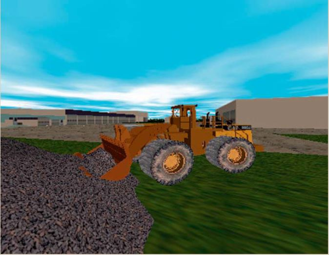

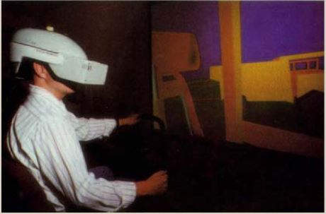

**vi. Adicione cuando menos 2 referencias (URL) halladas en el Web que traten el mismo tema o equivalente (y que no estén ya indicadas en el libro dado).**

https://www.youtube.com/watch?v=r9N1w8PmD1E
https://www.youtube.com/watch?v=VGtCQWROytw
https://www.equipmentworld.com/technology/video/14963961/how-caterpillar-is-developing-virtual-and-augmented-reality-to-design-and-service-heavy-equipment?__cf_chl_rt_tk=yvdZsHJ9T1UzybY_33D5XbeRT4pqSZaRY82oRDAAI8c-1724205932-0.0.1.1-5439

**3. Busque en Internet diferentes casos de aplicación de la Realidad Virtual (o sus variantes actuales), elija 1 caso y descríbalo en su informe.**

**a) Nombre del sistema o producto**

**VR Fire Training**

**b) Objetivo o finalidad del mismo**

El objetivo es brindar entrenamiento de seguridad contra incendios en un en un entorno seguro y en todo lugar a todo momento (según el Slogan del producto).

**c) Ámbito de aplicación**

El ámbito de aplicación es el de herramientas de realidad virtul para el entrenamiento.

**d) Breve descripción del mismo incluyendo 2 ó más imágenes representativas**
VR fire safety training de Vobling es un sistema de entrenamiento en realidad virtual diseñado para enseñar y practicar procedimientos de seguridad contra incendios en un entorno seguro y controlado. El entrenamiento incluye situaciones simuladas donde los usuarios pueden aprender a identificar riesgos, usar extintores de incendios y evacuar áreas peligrosas de manera efectiva.

Este sistema utiliza la inmersión de la realidad virtual para proporcionar una experiencia realista, permitiendo a los usuarios practicar sus respuestas ante emergencias sin los riesgos asociados a un incendio real. La capacitación puede personalizarse para diferentes escenarios y tipos de edificios, lo que lo hace útil para una amplia gama de industrias y entornos laborales. Además, se pueden registrar las acciones de los usuarios para análisis posterior, lo que ayuda a identificar áreas de mejora en la respuesta ante emergencias.

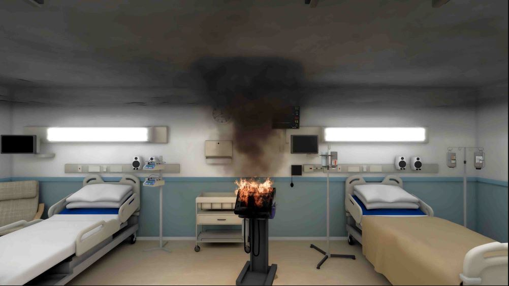

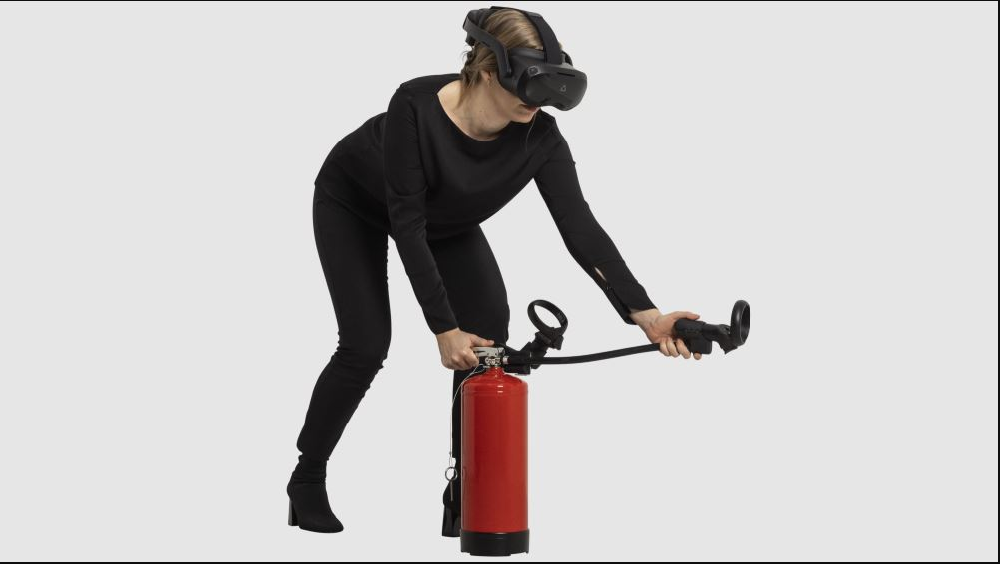

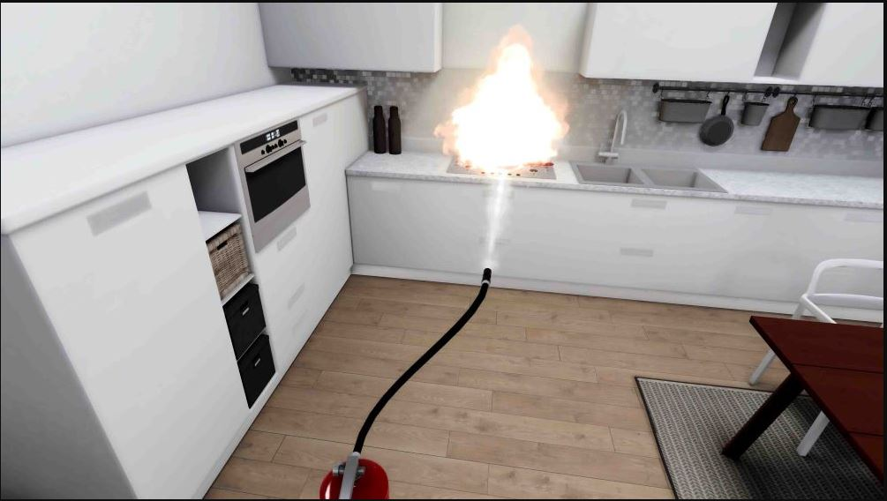

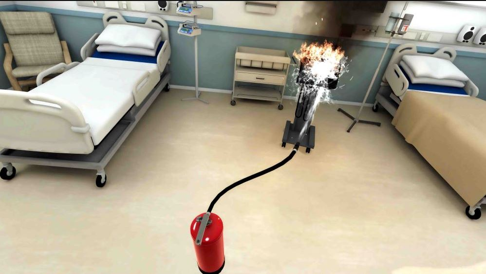

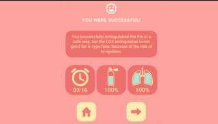

**e) Lista de Dispositivos de entrada requeridos**

- Extintor de incendios interactivo con mando junto con los sensores para el seguimiento de las partes del mismo.
- Sensores para el seguimiento del movimiento en el casco de realidad virtual.

**f) Lista de Dispositivos de salida requeridos**

- Casco de realidad Virtual (salida visual).
- Casco de realidad Vritual (salida aural).

**g) Referencia comercial/URL**

https://vobling.com/buy

**h) Año aproximado de su tratamiento y/o lanzamiento**

Alrededor del 2020.

**4. Luego de haber evaluado todos estos casos de aplicación, plantee un escenario en el cual crea Ud. que no se ha avanzado lo suficiente y en el cual podría orientar su trabajo integrador.**

**Detalle la solución propuesta, incluyendo imágenes recopiladas de internet o un bosquejo propio que sintetice la idea**

Pienso que, en el ámbito de la manufactura, sobre todo en el diseño de equipos o piezas, se podría avanzar en el desarrollo de herramientas que permitan la realización de prototipos virtuales rápidos y funcionales, que permitan realizar montajes y pruebas tempranas, lo que puede permitir reducir los tiempos de fabricación enormemente así como los costos de materiales para la realización de los prototipos. Incluso, serían herramientas con ventajas respecto de los prototipos rápidos que se pueden lograr con impresión 3D por ejemplo. 

La solución pienso que estaría enfocada sobre todo desde la realidad mixta y no tanto desde la realidad virtual para permitir por ejemplo, testear el funcionamiento/adecuación del prototipo en el lugar de emplazamiento de la máquina/pieza/equipo final. En principio requeriría un HMD para lograr la representación visual de los elementos del mundo virtual sobrepuestos sobre la visión real, mandos que permitan manipular dimensiones y formas de los prototipos virtuales y realizar ensamblajes de varías piezas o para tomar mediciones aproximadas de piezas y espacios. Se podría además incorporar realimentación aural para indicar por ejemplo el encaje de piezas o la colisión de elementos en vista de que tal vez la realimentación háptica de las mismas condiciones sería mas compleja. Aunque también se podría lograr realimentación háptica con motores de vibración para lograr el mismo efecto.

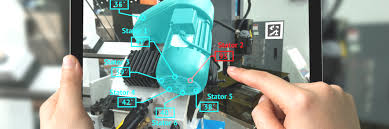

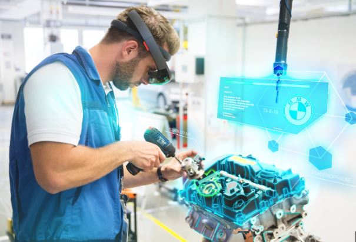

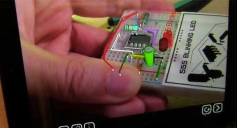

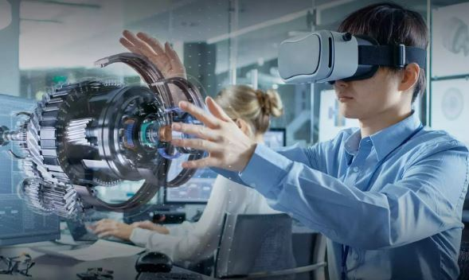

